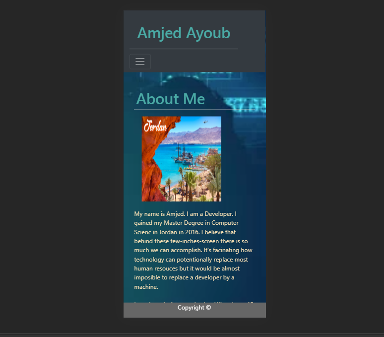
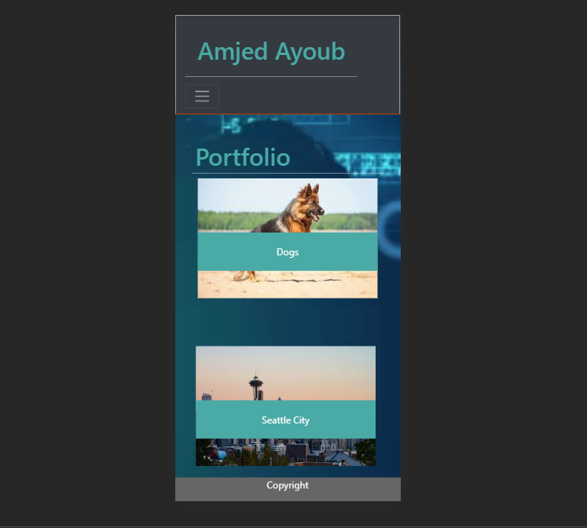
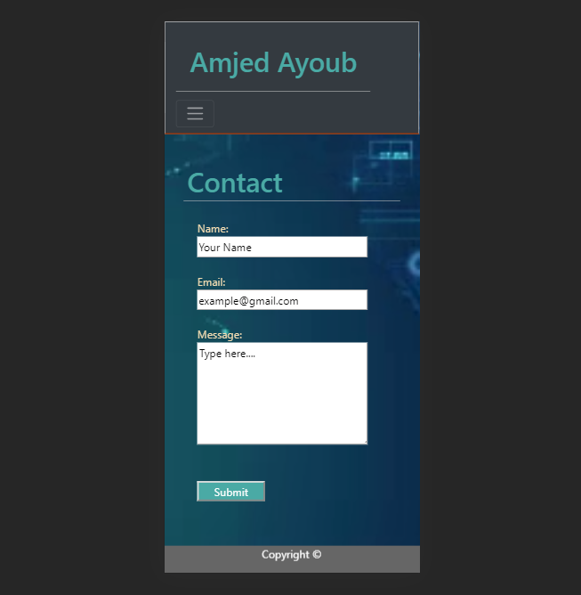

# Responsive-Portfolio
## Overview
This project is a professional portfolio site using basic HTML and **Bootstrap** CSS Framework, enhanced with a ***mobile-responsive*** layout. The site has three pages with fixed Navbar with links to some *fun games!*, Footer and a video playing in the background.
* "About" which includes a header, image and paragraphes.
* "Portfolio" shows images with labels.
* "Contact" includes a contact form.
## Screen-shots
#### About page

#### Portfolio page

#### Contact page

## Link
It is currently hosted on [Github Pages](https://amjedayoub.github.io/Responsive-Portfolio).